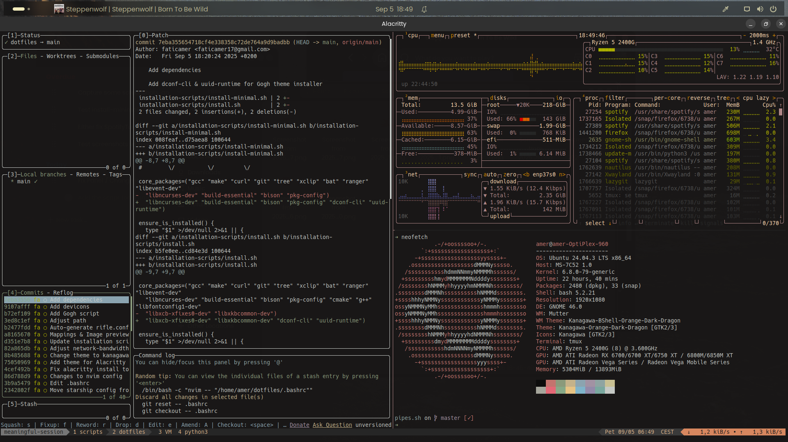
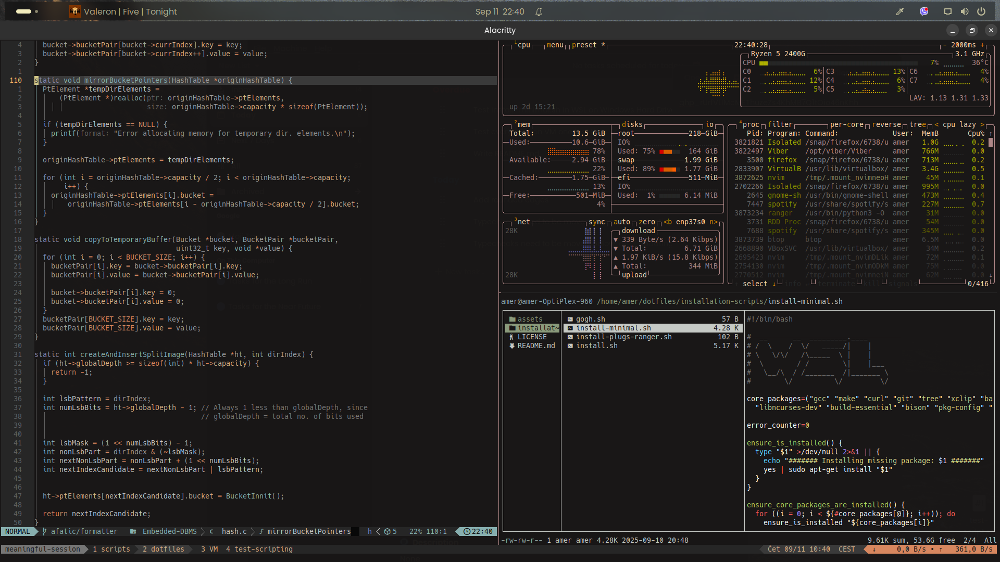
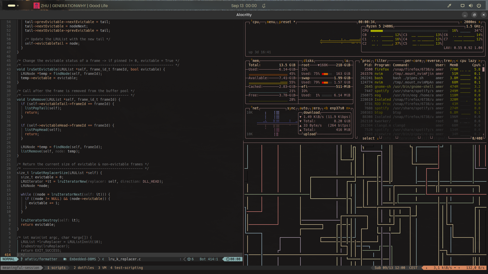

# Dotfiles

First clone this repo to your home directory:
```git
git clone https://github.com/faticamer/dotfiles.git ~/dotfiles
```

Make sure you have [GNU Stow](https://www.gnu.org/software/stow/) installed, then simply run:
```bash
stow .
```

GNU Stow will then create symlinks, assuming that your .config directory (target directory) matches the Stow directory.

> [!IMPORTANT]
> It is extremely important that **Stow directory** matches the **target directory**. If you're not familiar with these terms, run `man stow` for more information.

In installation-scripts directory, there are a few scripts to quickly install and setup your development environment. For more info, refer to the [documentation](./installation-scripts/README.md).

---

I am using **kanagawa** color scheme for most of the tools. You can find some screenshots in [assets](./assets/screenshots/) directory. Additionally, you can find images I use in  [wallpapers](./assets/wallpapers/) directory.

> [!NOTE]
> You can remove `.stow-local-ignore` file. Make sure to `rm -r` directories **installation-scripts** and **assets**. GNU Stow will then revert back to the global `.stow-global-ignore` file.

---

## Gallery

🖼️ [**term_1.png**](./assets/screenshots/term_1.png)

---


🖼️ [**term_2.png**](./assets/screenshots/term_2.png)

---


🖼️ [**term_3.png**](./assets/screenshots/term_3.png)

---
